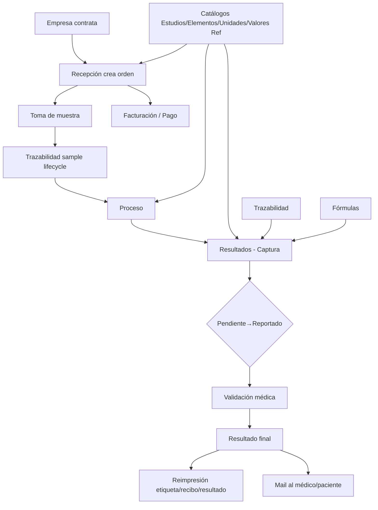

# AUDITORÍA COMPLETA — NOVA LIS → AMI

**ID:** `ARCH-20260630-02`
**Fecha:** 2026-06-30
**Auditor:** INTEGRA (con Playwright MCP + curl)
**Origen:** Frank identifica que AMI y NOVA conviven; captura dual en laboratorios.
**Estado:** [✓] Auditoría forense completa — listo para decisión arquitectónica.

---

## 1. RESUMEN EJECUTIVO

NOVA Connection (`https://sem.novaconnection.mx/i`) es un **LIS (Laboratory Information System) completo** propiedad del cliente, dedicado al flujo de laboratorios, NO un módulo aislado. Consta de **45 módulos agrupados en 5 áreas** (Captura, Catálogos, Operación, Reportes, Configuración) y maneja **todo el ciclo de vida de un estudio de laboratorio**: admisión → toma de muestra → procesamiento → captura de resultados → validación → entrega → facturación.

El sistema corre sobre stack legacy: **PHP/Apache + jQuery + Bootstrap 3 + AdminLTE + Vue 2.6 + Vuetify + DataTables** con URLs planas tipo `/<page>?mod=<module>` y autenticación por cookie `PHPSESSID`. La UI es densa (formularios grandes, tablas server-side con DataTables, modales apilados).

**El objetivo de absorción es replicar toda la funcionalidad del LIS dentro de AMI** para que la operación de laboratorio se ejecute 100% en una sola plataforma. Frank autorizó alcance "réplica 1:1 de lo que aporte valor", con migración de datos recientes.

---

## 2. INFRAESTRUCTURA Y STACK DETECTADO

### 2.1 Frontend
| Tecnología | Versión detectada | Uso |
|---|---|---|
| jQuery | 3.x (via Bower) | Base de toda la UI |
| jQuery Migrate | 3.0.0 | Compatibilidad (código legacy) |
| Bootstrap | 3.x (AdminLTE) | Layout, componentes |
| AdminLTE | (template) | Skin azul, sidebar, topbar |
| Font Awesome | 4.7 | Iconos |
| jQuery UI | 1.12 | Datepicker, accordion |
| Select2 | última | Autocompletes, selectores |
| Bootstrap Datepicker | última | Fechas |
| Timepicker | última | Horas |
| CKEditor | 4.x | Editor rich-text (notas) |
| Toastr | última | Notificaciones |
| Morris.js + Raphael | última | Gráficas |
| DataTables | jQuery plugin | Tablas server-side |
| Nestable | jQuery | Drag/drop reordenable |
| Vue.js | **2.6.12** | Componentes dinámicos en algunos módulos |
| Vuetify | última | Componentes Material en zonas Vue |
| Axios | última | HTTP para Vue |
| Intl Tel Input | última | Teléfono con código país |

### 2.2 Backend (inferido)
| Señal | Deducción |
|---|---|
| Server header | `Apache/2.4.67 (Debian)` |
| Cookie | `PHPSESSID` (PHP nativo) |
| URLs | `/<page>?mod=<module>` y `/<page>` PHP includes |
| AJAX | `ms.jx()` wrapper casero XHR; form-urlencoded |
| XHR autocomplete | `POST /recepcion` con `user=...` → JSON |
| Login JS | dos pasos: validarUsuario → validarContrasena |
| Csrf/Nonce | Ninguno detectado (no protege contra replay, riesgo menor) |
| BD | Probablemente **MySQL** (timestamp de Apache/Debian sugiere PHP+MySQL estándar) |

### 2.3 Auth & sesión
- Login en 2 pasos con `rd=<timestamp>` para anti-cache.
- Cookie `PHPSESSID` válida 30 min por defecto PHP.
- Sin 2FA, sin CSRF token.
- Multi-sucursal: usuario autenticado ve solo su sucursal (en este caso MATRIZ=1).

---

## 3. INVENTARIO COMPLETO DE MÓDULOS (45)

### 3.1 Captura (8) — *operación diaria crítica*
| Módulo | URL | Descripción funcional |
|---|---|---|
| **Recepción** | `/recepcion` | Admisión de pacientes, captura de estudios, descuentos, generación de orden |
| **Modificar folio** | `/modificar_folio` | Edición de órdenes existentes |
| **Cortesías** | `/cortesias` | Registro de órdenes con cargo 0 (muestras internas, empleados) |
| **Corte de caja** | `/corte_caja` | Cierre diario de movimientos, generación de reporte |
| **Resultados** | `/resultados` | Captura de resultados por estudio, con ciclo P/R/A/V |
| **Tesorería** | `/tesoreria` | Pagos, abonos, formas de pago, movimientos de caja |
| **Facturación** | `/facturacion` | Facturación electrónica (CFDI) |
| **Notificaciones** | `/notificaciones` | Bandeja de avisos, envío de resultados por mail |

### 3.2 Catálogos (19) — *maestros del sistema*
| Módulo | URL | Función |
|---|---|---|
| Empresas | `/catalogos?mod=catalogo_empresas` | Cliente (empresa que contrata) |
| Médicos | `/catalogos?mod=catalogo_medicos` | Médicos solicitantes |
| Pacientes | `/catalogos?mod=catalogo_pacientes` | Sujetos de estudio |
| Servicios | `/catalogos?mod=catalogo_servicios` | Servicios extra (no estudios) |
| Descuentos | `/catalogos?mod=catalogo_descuentos` | Tipos de descuento configurables |
| Usuarios | `/catalogos?mod=catalogo_usuarios` | Personal con acceso al LIS |
| Firmas | `/catalogos?mod=catalogo_firmas` | Firmas digitalizadas de médicos |
| Lugares de proceso | `/catalogos?mod=catalogo_lugares_proceso` | Áreas físicas (Química, Hematología, etc.) |
| Departamentos | `/catalogos?mod=catalogo_departamentos` | Deptos del laboratorio |
| Recipientes | `/catalogos?mod=catalogo_recipientes` | Tubo, frasco, contenedor de muestra |
| Muestras | `/catalogos?mod=catalogo_muestras` | Tipos (Sangre, Orina, etc.) |
| Metodologías | `/catalogos?mod=catalogo_metodologias` | Método analítico por estudio |
| Indicaciones | `/catalogos?mod=catalogo_indicaciones` | Prepaciente (ayuno, etc.) |
| Valores de referencia | `/catalogos?mod=catalogo_valores_referencia` | Rangos normales por edad/sexo |
| Unidades | `/catalogos?mod=catalogo_unidades` | mg/dL, mmol/L, etc. |
| Clasificaciones | `/catalogos?mod=catalogo_clasificaciones` | Patrón/estado (Normal, Patrón A, etc.) |
| Respuestas rápidas | `/catalogos?mod=catalogo_respuestas_rapidas` | Textos predefinidos |
| Movs. de caja | `/catalogos?mod=catalogo_tipos_cargos` | Tipos de movimiento de caja |
| Bacterias | `/catalogos?mod=catalogo_bacterias` | Catálogo microbiológico |

### 3.3 Catálogos de pruebas — *modelo de pruebas*
| Módulo | URL | Función |
|---|---|---|
| Estudios | `/catalogo_pruebas?tipo=estudios` | Cada prueba realizable (BH, QS, EGO, etc.) |
| Perfiles | `/catalogo_pruebas?tipo=perfiles` | Agrupador (ej: "Perfil lipídico") |
| Cultivos | `/catalogo_pruebas?tipo=cultivos` | Pruebas microbiológicas |
| Elementos | `/catalogo_pruebas?tipo=elementos` | Analitos/parámetros dentro de estudio |
| Antibiogramas | `/catalogo_pruebas?tipo=antibiogramas` | Catálogo ATB |
| Paquetes | `/paquetes` | Conjunto comercial de estudios |

### 3.4 Operación, trazabilidad y reportes (4+4+4)
| Módulo | URL | Función |
|---|---|---|
| Órdenes canceladas | `/ordenes_canceladas` | Auditoría de cancelaciones |
| Bitácora de resultados | `/bitacora_resultados` | Auditoría de cambios en resultados |
| Trazabilidad | `/trazabilidad` | Seguimiento muestra → proceso → resultado |
| Requisitos de órdenes | `/reportes?mod=requisitos` | Listado de requisitos por estudio |
| Reimprimir etiquetas | `/reimpresion_etiquetas` | Etiquetas de muestra |
| Reimprimir cotizaciones | `/reimpresion_cotizaciones` | Cotización al paciente |
| Reimprimir recibos | `/reimpresion_recibos` | Recibo de pago |
| Reimprimir resultados | `/reimpresion_resultados` | Hoja de resultados |

### 3.5 Configuración (4)
| Módulo | URL | Función |
|---|---|---|
| Ajustes | `/ajustes` | Notificaciones, agenda, parámetros grales |
| Listas de precios | `/precios_pruebas` | Tarifas por prueba + urgentes + descuentos |
| Fórmulas | `/formulas` | Cálculos automáticos de analitos derivados |
| Respuestas predefinidas | `/respuestas_predefinidas` | Texto estándar por estudio |

---

## 4. MAPA FUNCIONAL DEL FLUJO PRINCIPAL



---

## 5. ANATOMÍA DETALLADA DE PANTALLAS CRÍTICAS

### 5.1 Recepción (`/recepcion`) — **la más usada**
**Estructura:**
```
┌────────────────────────────────────────────────────────────────┐
│ TOP: [Bitácora] [◀ Anterior] [Siguiente ▶] [fecha] [Nuevo]    │
├────────────────────────────────────────────────────────────────┤
│ DATOS PACIENTE: [Paciente▼] [Edad] [Dto%Paciente]             │
│ DATOS MÉDICO:   [Médico▼] [Dto%Médico] [Comisión%] [Clasif▼]  │
│ DATOS EMPRESA:  [Empresa▼] [Dto%Empresa] [Convenio▼]          │
│ OBSERVACIONES: [Nota ...]                                      │
├────────────────────────────────────────────────────────────────┤
│ BÚSQUEDA DE ESTUDIOS: [Clave][C.Alt][Estudio]                  │
│ ┌───────────────────────────────────────────────────────────┐  │
│ │ Tabla estudios: [×] | Clave | Estudio | Precio | Dcto$ | % | Importe │ │
│ └───────────────────────────────────────────────────────────┘  │
├────────────────────────────────────────────────────────────────┤
│ CAJA: [Urg☐][Conf☐][TomaDom☐][Mail☐][Fact☐] [Idioma:ES/EN]   │
│ ENTREGA: [Fecha entrega] [Hora entrega]  [Devolución][Cortesía]│
│ TOTALES: Subtotal=$  IVA=$  Total=$                          │
│ ACCIONES: [Guardar Ctrl+S] [Pagos Ctrl+P] [Cotizaciones] [Cotizar] │
└────────────────────────────────────────────────────────────────┘
```

**Campos clave inferidos (estado al crear):**
- `folio` (autogen), `clave_paciente`, `edad_paciente`, `dcto_paciente`, `clave_dr`, `comision_medico`, `dcto_medico`, `clave_emp`, `dcto_empresa`, `clasificacion_id`, `convenio_id`, `observaciones`, `urgente`, `confidencial`, `toma_domicilio`, `resultados_mail`, `generarFactura`, `idioma_impresion`, `fecha_entrega`, `hora_entrega`.
- **Tabla estudios** detalle: cada fila es un `estudio_id` con precio, descuento monetario, descuento %, importe final.
- **Totales**: Subtotal, IVA, Total a pagar — calculados live en cliente.
- **Atajos teclado**: Ctrl+B (buscar folio), Ctrl+O (fecha), Ctrl+R (nuevo), Ctrl+S (guardar), Ctrl+P (pagos).

### 5.2 Resultados (`/resultados`)
**Filtros:**
- Folio, paciente (autocomplete por clave+edad), médico (autocomplete), estudio, rango fecha, rango hora con `filtro_por_hora`.
- Flags: urgentes, confidenciales, por_mail, pendientes, reportados, autorizados, validados.

**Acciones principales:**
- `P` (Pendiente), `R` (Reportado), `A` (Autorizado), `V` (Validado) — cambio de estado
- Hoja de trabajo (imprime cuadernillo para el técnico)
- **Desautorizar**, **Invalidar** (con motivo y bitácora)

### 5.3 Catálogos (`/catalogos?mod=...`)
**Todos comparten patrón idéntico:**
- Filtro `clave` / `nombre` / `id` según corresponda
- Botón `Buscar`
- Tabla DataTables server-side con paginación, buscar, orden
- Acciones por fila: `Editar`, `Eliminar` (con confirmación)
- Sin botones visibles "Crear nuevo" en HTML (probable modal Vue.js o DataTables `new` action)

**Variaciones por catálogo:**
| Catálogo | ID/Nombre lookup |
|---|---|
| Empresas | clave + nombre + estado (`estadoEmpresa`) |
| Médicos | `clave_medico` + `nombre` + `colonia` + `especialidad` |
| Pacientes | `clave` + `nombre` (no se ven más campos en HTML) |
| Departamentos | `id` + `departamento` |
| Bacterias | `bacteria` (sólo nombre) |
| Lugares de proceso | `clave` + `nombre` |
| Clasificaciones | `id` + `clasificacion` |
| Indicaciones | `id` + `indicacion` |
| Metodologías | `id` + `metodologia` |
| Muestras | `id` + `muestra` |
| Paquetes | `clave` + `clave_alterna` + `paquete` (mostrados en tabla) |
| Recipientes | `id` + `recipiente` |
| Respuestas rápidas | `clave` + `respuesta` |
| Unidades | `id` + `unidad` |
| Usuarios | `clave` + `nombre` |
| Valores de referencia | `id` + `valorReferencia` |
| Firmas | `clave_buscar` + `nombre_buscar` |
| Descuentos | `nombre` (sin clave explícita) |

### 5.4 Catálogo de pruebas (`/catalogo_pruebas?tipo=...`)
**Mismo formulario:** `clave`, `alterna` (clave alterna), `nombre`.
- Variantes: estudios | perfiles | cultivos | elementos | antibiogramas
- Cada tipo tiene su propia tabla DataTables server-side

### 5.5 Configuración — Ajustes (`/ajustes`)
- **Bandeja de notificaciones** (días[])
- **Agenda del laboratorio**: `nombre[]`, `correo[]`, `habilitado`, `duracion` por día, `periodos[ini][]` / `[fin][]`
- Botones: "Copiar horarios" L-V / L-S, "Guardar"

### 5.6 Trazabilidad (`/trazabilidad`)
- Filtros: rango fecha (f_ini/f_fin), folio, paciente, médico, estudio
- Vista cronológica: paciente → toma → lugar de proceso → captura → validación → entrega
- Exportable

### 5.7 Tesorería (`/tesoreria`)
- Filtros: rango fecha, folio, paciente, médico
- Por cada orden: array `abono[]`, `forma_pago[]`, `tipo_cambio[]`, `moneda[]`, `referencia[]`, `devAb[]`
- Exportable

### 5.8 Listas de precios (`/precios_pruebas`)
- Inputs: `cantidad`, `concepto_precio`, `concepto_urgencia`, `concepto_dcto`, `opIncremento`, `incDesc`, `claveEst`, `nombre_est`, `op`
- Botones: Aplicar, Guardar precios, Modificar precios consultados, Exportar
- Sistema multi-lista y multi-concepto (precio base, urgencia, descuentos)

### 5.9 Fórmulas (`/formulas`)
- Inputs: `parametros[]`, `formulas[]`, `clave`, `nombre`, `txtParametro`, `txtFormula`
- Operadores visibles (suma, resta, etc.) — calcular analitos derivados (ej. VLDL = Trig/5)

### 5.10 Respuestas predefinidas (`/respuestas_predefinidas`)
- Tabs: Estudios / Respuestas
- Inputs: `claveBusca`, `nombreBusca`, `idRespuesta`, `claveEst`, `respuesta`

### 5.11 Reimpresión de etiquetas/resultados/recibos
- Filtros: rango fecha, folio, paciente, médico, estudio, sucursales
- Acciones masivas (imprimir varios a la vez)

---

## 6. MODELO DE DATOS INFERIDO (entidades núcleo)

> **Nota:** Inferencia basada en estructura HTML + URL params + autocompletes. No se inspeccionó el `schema.sql` directamente. Las cardinalidades marcadas `(N)` requieren validación cuando Frank comparta el dump SQL.

### 6.1 Entidades principales

```
EMPRESA ──┐
          ├──► (N) ORDEN ──┬──► (N) ESTUDIO_EN_ORDEN ──► ESTUDIO
          │                │                                  │
          │                │                                  ├──► (N) ELEMENTO
          │                │                                  ├──► UNIDAD
          │                │                                  └──► VALOR_REFERENCIA
          │                ├──► (1) PACIENTE
          │                └──► (1) MEDICO
          │
          └──► (1) CONVENIO
```

```
ORDEN {
  folio, clave_paciente, edad_paciente, dcto_paciente,
  clave_dr (medico), comision_medico, dcto_medico,
  clave_emp (empresa), dcto_empresa, convenio_id, clasificacion_id,
  observaciones, sucursal_id, usuario_id,
  urgente, confidencial, toma_domicilio, resultados_mail,
  generarFactura, idioma_impresion,
  fecha_creacion, fecha_entrega, hora_entrega,
  cotizacion_id, cortesia_id,
  subtotal, iva, total,
  estatus (PENDIENTE|CANCELADA|COMPLETADA|FACTURADA)
}

ESTUDIO_EN_ORDEN {
  orden_id, estudio_id,
  precio, dcto_monto, dcto_pct, importe,
  estatus_resultado (P|R|A|V|INVALIDO)
}

RESULTADO {
  estudio_en_orden_id, elemento_id,
  valor (texto libre o número), unidad_id,
  valor_referencia_texto, fuera_de_rango (bool),
  metodo_id, muestra_id, recipiente_id,
  lugar_proceso_id, observaciones,
  capturado_por, capturado_en,
  autorizado_por, autorizado_en,
  validado_por, validado_en,
  bitacora_eventos[]
}

ESTUDIO {
  clave, clave_alterna, nombre, tipo (estudio|perfil|cultivo|elemento|antibiograma),
  departamento_id, lugar_proceso_id_default,
  metodologia_id, dias_procesamiento, requiere_muestra_id,
  precio_base, precio_urgencia, formulas_vinculadas[]
}

ELEMENTO {
  estudio_id_padre (si aplica), clave, clave_alterna, nombre,
  unidad_id_default, valor_referencia_template_id, orden_visualizacion,
  tipo_dato (num|texto|enum|cualitativo)
}

VALOR_REFERENCIA {
  elemento_id, sexo (M|F|A), edad_min, edad_max,
  rango_min, rango_max, texto (ej: "Negativo")
}

MUESTRA { id, nombre, recipiente_default_id, conservacion, volumen_min }
RECIPIENTE { id, nombre, color, tapa }
METODOLOGIA { id, nombre, principio (ELISA|QUIMICA|etc) }
UNIDAD { id, simbolo, nombre, sistema (SI|convencional) }
LUGAR_PROCESO { id, nombre, departamento_id, horario }
DEPARTAMENTO { id, nombre }
CLASIFICACION { id, nombre, color }
BACTERIA { id, nombre, genero, especie }
ANTIBIOGRAMA { id, antibiotico, bacteria_target }
FORMULA { estudio_id, parametros[], formula_texto, tipo_resultado }
RESPUESTA_PREDEFINIDA { estudio_id, texto }
RESPUESTA_RAPIDA { clave, texto }

PACIENTE {
  clave, nombre, edad, sexo, telefono, correo, direccion,
  empresa_id (opcional), empresa_externa,
  fecha_alta
}

MEDICO {
  clave_medico, nombre, especialidad, colonia, direccion,
  telefono, correo, comision_default
}

EMPRESA {
  clave, nombre, estado, direccion, telefono, correo,
  rfc, contacto, convenio_id
}

USUARIO_NOVA {
  clave, nombre, password_hash, sucursal_id, rol, permisos
}

CONVENIO { id, nombre, condiciones, descuento_global_pct }

DESCUENTO { id, nombre, tipo (PORCENTAJE|MONTO), valor }

FIRMA { id, usuario_id, imagen_path }

CAJA_MOVIMIENTO {
  fecha, sucursal_id, usuario_id, tipo (abono|cargo|devolucion),
  monto, forma_pago (efectivo|tarjeta|transferencia|cheque),
  moneda, tipo_cambio, referencia, orden_id
}

BITACORA_RESULTADO {
  resultado_id, accion (CREATED|UPDATED|INVALIDATED|REPORTED|AUTHORIZED|VALIDATED),
  usuario_id, fecha, antes (JSON), despues (JSON), motivo
}

TRAZABILIDAD_EVENTO {
  muestra_id, orden_id, estudio_id, evento (RECEPCION|PROCESO|ANALISIS|VALIDACION|ENTREGA),
  timestamp, usuario_id, lugar_proceso_id, notas
}
```

### 6.2 Cardinalidades clave
- `EMPRESA 1-N ORDEN`
- `ORDEN 1-N ESTUDIO_EN_ORDEN`
- `ORDEN 1-1 PACIENTE` (un paciente por orden; el paciente puede repetir)
- `ORDEN 1-1 MEDICO`
- `ESTUDIO 1-N ELEMENTO` (analitos de la prueba)
- `ESTUDIO N-N ELEMENTO` (un elemento puede estar en varios estudios)
- `ELEMENTO 1-N VALOR_REFERENCIA` (rangos por edad/sexo)
- `ESTUDIO 1-N FORMULA` (cálculos derivados)
- `ESTUDIO N-N TRAZABILIDAD_EVENTO` (a través de la muestra)
- `RESULTADO 1-N BITACORA_RESULTADO` (auditoría de cambios)

---

## 7. ENDPOINTS Y CONTRATOS HTTP (lo deducible)

### 7.1 Login
```
POST /login?rd=<ts>
Body: user=FRANCISCO&accion=validarUsuario       → JSON {error, nombre, sucursales:[]}
POST /login?rd=<ts>
Body: pass=…&sucursal=1&accion=validarContrasena → JSON {error} + Set-Cookie PHPSESSID
```

### 7.2 Autocompletes (XHR vía ms.jx)
```
POST /recepcion  body=user=<paciente-prefix>    → JSON {results:[{clave, nombre, edad}]}
POST /recepcion  body=user=<medico-prefix>     → JSON […]
POST /recepcion  body=user=<empresa-prefix>    → JSON […]
POST /recepcion  body=clave=<estudio-prefix>   → JSON [{clave, alterna, nombre, precio}]
```

### 7.3 Catálogos (DataTables server-side)
```
GET /catalogos?mod=<X>&draw=1&start=0&length=25&search[value]=…&order[0][column]=0&order[0][dir]=asc
→ JSON {draw, recordsTotal, recordsFiltered, data:[…]}
```

### 7.4 Crear / actualizar / eliminar (no documentado — necesitan interceptación)
Probablemente:
```
POST /recepcion   body=accion=guardar&…  → JSON {ok:true, folio}
POST /resultados  body=accion=…          → JSON {ok}
POST /catalogos?mod=X  body=…             → JSON
```

> **Para AMI:** replicar el contrato REST moderno (no replicar URLs planas). Ver ADR.

---

## 8. LIMITACIONES DE LA AUDITORÍA

1. **Sin captura de XHR en vivo**: la auditoría navegó vía curl (HTML estático). Para mapear endpoints exactos de acciones (`guardar`, `autorizar`, `cancelar`), se requiere sesión Playwright activa sin colisión con AMI.
2. **Sin dump SQL**: el `schema.prisma` AMI no contrasta contra el schema real de NOVA. Las cardinalidades marcadas `(N)` arriba son inferencia hasta validación.
3. **Sin datos seed**: el sistema tiene un logo del cliente (sem.novaconnection.mx/mail/logo.png) y `MATRIZ` como sucursal. Hay 1 usuario visible (ING FRANCISCO SAAVEDRA). No se inspeccionaron los datos reales.

---

## 9. ARTEFACTOS GENERADOS EN ESTA AUDITORÍA

```
context/audits/nova-20260630/
├── AUDIT-NOVA-COMPLETO.md             ← este archivo
├── catalog-meta.json                  ← metadata extraída de 19 catálogos
├── menu-completo.txt                  ← árbol de navegación
├── extract.py / extract2.py           ← scripts de extracción HTML
├── cookies.txt                        ← sesión PHPSESSID (no committed, .gitignore)
├── step1.json / step2.json            ← respuestas login (referencia)
├── pages/                             ← HTML de 45 rutas (60+ archivos)
└── ../.playwright-mcp/nova/           ← 2 screenshots principales
```

---

## 10. CONCLUSIÓN Y PRÓXIMO PASO

NOVA es **absorbible en su totalidad** dentro de AMI si Frank lo confirma. La decisión arquitectónica (qué se absorbe nativo en AMI vs qué se descarta vs qué se queda en NOVA coexistiendo) está en el **ADR-20260630-02** que se genera a continuación, y la **SPEC para construir el demo funcional con SOFIA** lo aterriza en slices ejecutables.

**Siguiente decisión requerida a Frank (micro-sprint):**
1. Confirmar el **corte de "datos recientes"** (ej: desde `2025-01-01`).
2. Confirmar si hay **dump SQL/CSV** disponible de NOVA (acelera el mapeo del modelo de datos).
3. Confirmar si los catálogos (Estudios, Elementos, Unidades, ValoresRef) **se migran tal cual** o se hace un catálogo unificado AMI.
4. Confirmar si las **Fórmulas** LIS pasan a AMI como `aiCalculation` o se reemplazan por la IA clínica (MedGemma).
